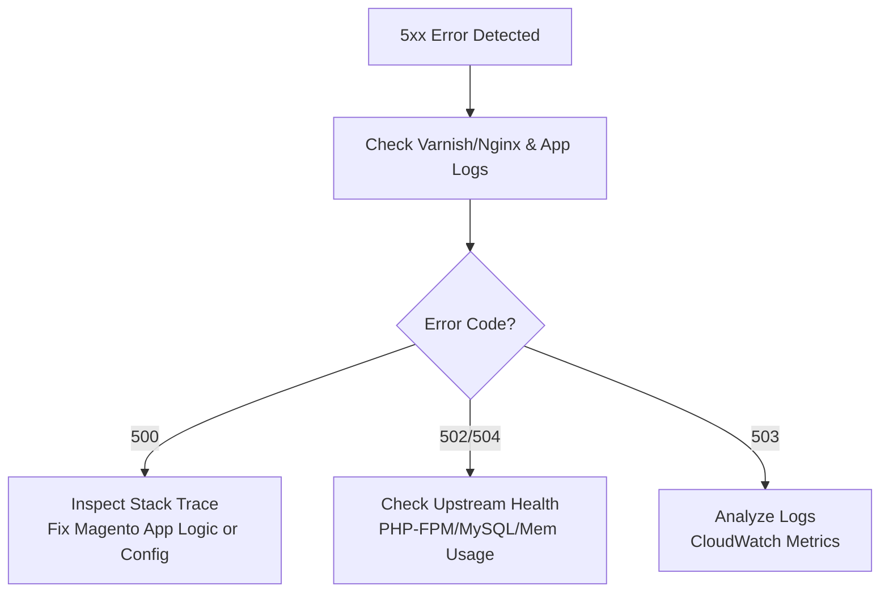

# 🛠️ Server Error Codes & Troubleshooting Guide

## 📖 Overview
This guide is aimed at helping developers understand common server error codes (5xx series), what they mean, and the initial troubleshooting steps to resolve them. Real-world examples from our infrastructure are included to illustrate these errors in context.

---

## ⚠️ Common 5xx Status Codes

| Code | Meaning                  | Example Scenario                        | First Step to Check             |
|------|--------------------------|----------------------------------------|----------------------------------|
| **500**  | Internal Server Error     | Magento throws fatal error on checkout page | Check PHP-FPM, app logs (`/var/log/nginx/error.log`, `php-fpm.log`) |
| **502**  | Bad Gateway              | Varnish can't connect to Magento (PHP-FPM or app server down) | Is PHP-FPM or Nginx running on the app server? Restart services if needed |
| **503**  | Service Unavailable      | App server overwhelmed | Check CloudWatch alarms/Monitor, request volume spike |
| **504**  | Gateway Timeout          | Magento is blocked on a long MySQL query or upstream timed out | Check RDS performance insights, slow query logs, or memory pressure on app servers |

---

## 🔍 General Troubleshooting Flow



---

## 🧪 Real Case Study: 502/504 due to Memory Exhaustion

**Incident Recap:**
```
All application servers behind Varnish went down. The EC2 instance hosting Varnish hit full memory usage,
causing the varnish service to stop responding and returning 502/504 errors across the site.
After restarting the varnish instance, memory was freed, app servers came back online, and the site recovered.
```

**Checklist: Immediate Fix**
- ✅ **Restart varnish server instance** to quickly bring the site back online
- ✅ **Restart varnish service and PHP-FPM** on app servers if still unresponsive
- ✅ **Check memory usage:**
```bash
free -m
top
df -h
```
- ✅ **Clear cache or restart services** that may be bloating memory
- ✅ **Monitor logs**:
```bash
journalctl -u varnish -f
sudo tail -f /var/log/nginx/error.log
```

> 🔁 This recovery approach is temporary — ideal for high-priority on-call response to restore uptime fast.

---

## 🛠️ Permanent Fix (In Progress)
To prevent recurrence, we are working on the following:

- 📦 **Auto-restart rules** for varnish and PHP-FPM using `systemd` or AWS SSM Automation
- 🚀 **Autoscaling** using CloudWatch/NR alarms + notifications
- 🧠 **Memory profiling** of Varnish and Magento app to detect memory leaks
- 💽 **Optimize cache TTLs** and avoid long-lived cache objects consuming memory
- 📉 **Downscale concurrent requests** with queueing/rate limits if memory exceeds safe thresholds

---

## 🛡️ Pro Tips for Developers

- Use **health checks** in Nginx and Varnish to remove unhealthy backends
- Tune PHP-FPM pool settings (`max_children`, `pm.max_requests`) to prevent exhaustion
- Use **New Relic** APM to trace high latency endpoints
- Log both request & response metadata for debugging:
```json
{
  "method": "POST",
  "url": "/rest/V1/orders",
  "status": 502,
  "responseTimeMs": 2115
}
```
- Always deploy with **observability in place** (e.g., slow query logging in RDS, PHP error logging enabled)

---

## 📚 More Helpful Error Codes (Non-5xx)

| Code | Category        | When It Happens |
|------|------------------|------------------|
| 400  | Bad Request      | Invalid API call from frontend |
| 401  | Unauthorized     | JWT expired, or invalid token |
| 403  | Forbidden        | Missing scopes/permissions in API key |
| 404  | Not Found        | Broken frontend links to removed Magento endpoints |
| 429  | Too Many Requests| Varnish or WAF rate limiting triggered |

---

## 🧰 Dev Tools & Commands

- **Tail Varnish/Nginx logs:**
```bash
journalctl -u varnish -f
sudo tail -f /var/log/nginx/error.log
```
- **Check PHP-FPM status:**
```bash
sudo systemctl status php8.1-fpm
```
- **Check memory usage:**
```bash
free -m
top
htop
```
- **Check MySQL query health:**
Use RDS Performance Insights or:
```sql
SHOW FULL PROCESSLIST;
```
- **Restart services:**
```bash
sudo systemctl restart varnish
sudo systemctl restart php8.1-fpm
```

---

## 📎 Recommended Reading

- [MDN Web Docs: HTTP Status Codes](https://developer.mozilla.org/en-US/docs/Web/HTTP/Status)
- [Magento Developer Docs](https://developer.adobe.com/commerce/)
- [AWS RDS Performance Insights](https://docs.aws.amazon.com/AmazonRDS/latest/UserGuide/USER_PerfInsights.html)
- [Varnish Documentation](https://varnish-cache.org/docs/)
- [Systemd Service Recovery Options](https://www.freedesktop.org/software/systemd/man/systemd.service.html)

---

## 📁 Next Steps
- [ ] Maintain current Varnish/Magento incident runbooks
- [ ] Build an internal knowledge base article for Tier 1 & Tier 2 support
- [ ] Automate recovery response for memory-related failures

---

Happy debugging! 🐛💻

> Authored by **Taiwo Akinwunmi** | DevOps @ Sunday | [taiwo.akinwunmi@sunday.de](mailto:taiwo.akinwunmi@sunday.de)
